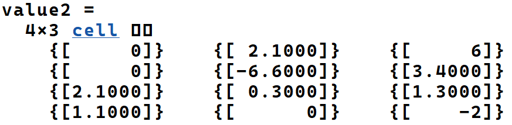

# 第二次作业

## Exercise2.1

* (a) 4x5

* (b) -3.5

* (c)

  size = 4x3 

  value如下图

  

* (d)

  size = 6

  value = 1.3

## Exercise2.2

* dog1          合法
* 1dog          不合法，以数字开头
* Do_you_know_the_way_to_san_jose         合法
* _help          不合法，以符号开头
* What's_up?   不合法，含有非下划线的字符

 ## Exercise2.3

```matlab
a =
     2     5     8
size_a =
     1     3
b =
     2     2     2
     5     5     5
     8     8     8
size_b =
     3     3
c =
     2     2
     8     8
size_c =
     2     2
d =
     7    10    13
size_d =
     1     3
w =
     0     0     0     1     1     1     3     4     5
size_w =
     1     9
b =
     2     8     2
     5     5     5
     8     2     8
size_b =
     3     3
e =
  空的 1×0 double 行向量
size_e =
     1     0
```

## Exercise2.4

```matlab
array1 =
  4×5 cell 数组
  列 1 至 4
    {[ 1.1000]}    {[     0]}    {[-2.1000]}    {[-3.5000]}
    {[      0]}    {[    -3]}    {[-5.6000]}    {[ 2.8000]}
    {[ 2.1000]}    {[0.3000]}    {[ 0.1000]}    {[ 0.4000]}
    {[-1.4000]}    {[5.1000]}    {[      0]}    {[ 1.1000]}
  列 5
    {[     6]}
    {[4.3000]}
    {[1.3000]}
    {[    -3]}
subarray1 =
  1×5 cell 数组
  列 1 至 4
    {[2.1000]}    {[0.3000]}    {[0.1000]}    {[0.4000]}
  列 5
    {[1.3000]}
subarray2 =
  4×1 cell 数组
    {[-2.1000]}
    {[-5.6000]}
    {[ 0.1000]}
    {[      0]}
subarray3 =
  2×3 cell 数组
    {[-2.1000]}    {[-2.1000]}    {[-3.5000]}
    {[ 0.1000]}    {[ 0.1000]}    {[ 0.4000]}
subarray4 =
  2×5 cell 数组
    {[1.1000]}    {[0]}    {[-2.1000]}    {[-3.5000]}    {[6]}
    {[1.1000]}    {[0]}    {[-2.1000]}    {[-3.5000]}    {[6]}
```

